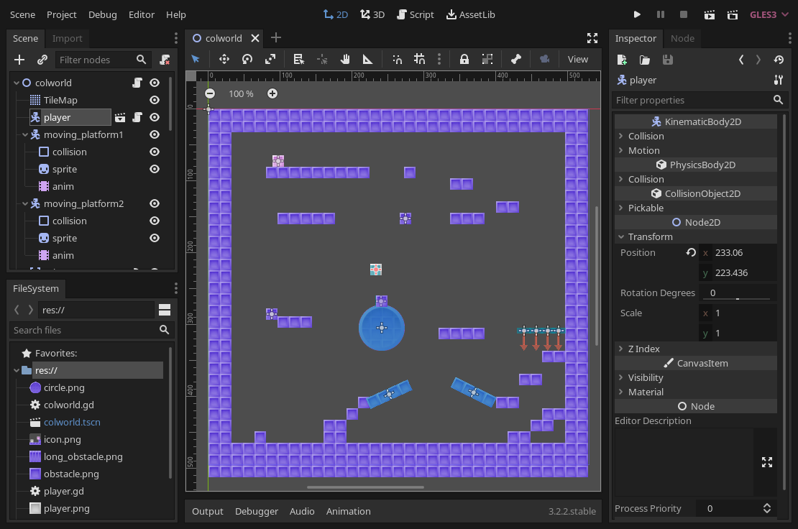
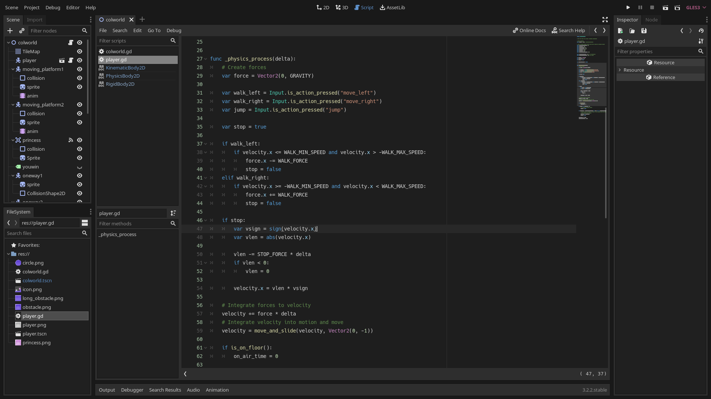

# Godot Editor Settings

This is my personal editor settings which I find useful at the moment. See
`editor_settings-*.tres` for all the settings which I override and individual
comments for each.

This also provides my favorite
[`VS-Code-Dark` theme](https://github.com/godotengine/godot-syntax-themes), and
the editor settings currently work best with this theme for the "dark mode" in
my opinion.

This might fit your needs if you:
* develop on desktop
* have two monitors
* used Godot 2.1 in the past
* use VSCode

## Installation

*Make sure to backup `Editor` → `Open Editor Data/Settings Folder`* first.

For entirely new setups, replace all the files in `Editor` →
`Open Editor Data/Settings Folder` with the files in this repository. Make sure
Godot is not running while doing this.

For existing setups, the manual copy and pasting works best, or just modify the
editor settings directly via GUI.

If you copy the editor settings file as-is, make sure to reset 
`text_editor/theme/color_theme` as the editor might not pick it up correctly.

## License

Copyright (C) 2020 Andrii Doroshenko.

Unless otherwise specified, files in this repository are licensed under CC0 1.0
Universal, see LICENSE.md for more information.
